# Lab 01: Create and Ingest Data with a Microsoft Fabric Lakehouse

### Estimated Duration: 90 Minutes

## 📘 Scenario

Contoso Retail wants to improve its data analytics capabilities by bringing together data from multiple sources into a unified platform. The organization has chosen Microsoft Fabric Lakehouse to store, manage, and analyze both structured and unstructured data at scale.

As a Data Analyst, you will create a Fabric workspace and Lakehouse, ingest and transform data, query it using SQL and visual tools, and build interactive Power BI reports to generate actionable business insights.

## 📋 Overview

The foundation of Microsoft Fabric is a Lakehouse, which is built on top of the OneLake scalable storage layer and uses Apache Spark and SQL compute engines for big data processing. A Lakehouse is a unified platform that combines:

- The flexible and scalable storage of a data lake
- The ability to query and analyze data in a data warehouse

Imagine your company has been using a data warehouse to store structured data from its transactional systems, such as order history, inventory levels, and customer information. You have also collected unstructured data from social media, website logs, and third-party sources that are difficult to manage and analyze using the existing data warehouse infrastructure. Your company's new directive is to improve its decision-making capabilities by analyzing data in various formats across multiple sources, so the company chooses Microsoft Fabric.

Here, we explore how a lakehouse in Microsoft Fabric can help address scenarios like this by providing a scalable and flexible data store for files and tables that you can query using
SQL.

## 🏗️ Architecture Diagram


## 🎯 Objectives

In this lab, you will complete the following tasks:

- Task 1: Create a workspace
- Task 2: Create a Lakehouse
- Task 3: Upload a file
- Task 4: Explore shortcuts
- Task 5: Load file data into a table
- Task 6: Use SQL to query tables
- Task 7: Create a visual query
- Task 8: Create a Report

## Task 1: Create a workspace

In this task, you will create a new workspace that serves as a collaborative environment for managing datasets, reports, dashboards, and other related resources. The workspace will act as a centralized location where you and your team can securely store, organize, and share content, enabling better collaboration and streamlined access for reporting and analytics.

Before working with data in Fabric, create a workspace with the Fabric trial enabled.

1. Open the Edge browser and sign in to [Microsoft Fabric](https://app.fabric.microsoft.com).

1. On the **Microsoft Fabric** page, enter the following email and click on **Submit** **(2)**.

   - **Email: (1)** <inject key="AzureAdUserEmail"></inject>

      

1. On the **Enter Temporary Access Pass** screen, enter the following password and click on **Sign in (2)**.
   
   - **Password: (1)** <inject key="AzureAdUserPassword"></inject> 

      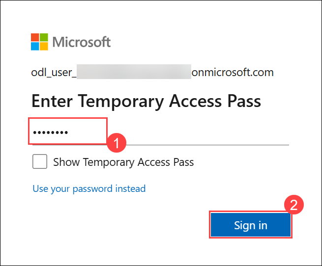
  
1. When **Stay signed in?** prompted, click on **Yes**.
  
   
   
   > **Note**: If you receive the **Welcome to the Fabric view** pop-up, click **Cancel** to skip the tour.
   >
   >   

1. On the **Fabric** home page, click the **Fabric** icon from the left pane to open the Fabric experience.

   

1. In the **Power BI** view, select **Power BI** from the dropdown.

   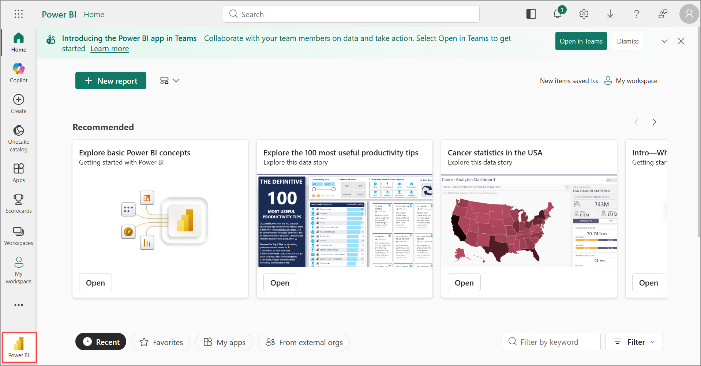

1. From the PowerBI home page, select **Account Manager (1)** from the top-right corner to start the **Start trial (2)** of Microsoft Fabric.

   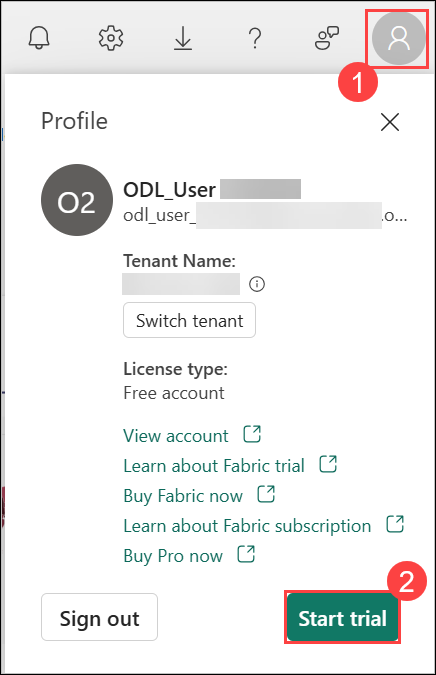

   >**Note:** The Fabric trial is enabled to ensure that your account has access to Microsoft Fabric features and experiences. However, the hands-on lab resources and workloads in this guide are configured to use the F2 Fabric capacity provided for the lab environment. The trial activation is only to enable Fabric access for your user account and does not replace the dedicated F2 capacity used throughout the lab.

1. On the **Start 60-day free Pro trial** window, click **Start trial** to activate your free 60-day Pro trial.

   

1. On the **All paid features of Power BI are yours for 60 days** confirmation window, click **Got it** to continue.

   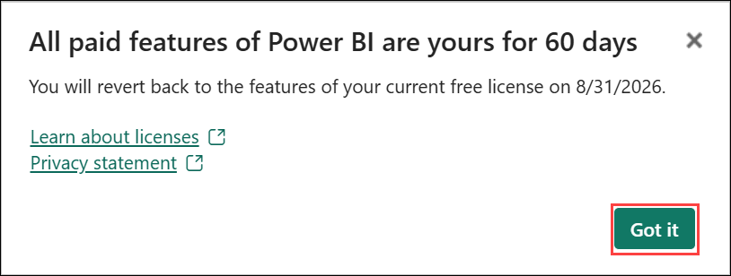

   > **Note:** If any invite cards are displayed, click **Cancel** to continue the setup.

1. Click the **Account manager (1)** icon in the top-right corner. Under the **Profile** section, verify that the **Trial Status (2)** shows the number of days remaining.

   

   > **Note:** You now have a **Fabric (Preview) trial** that includes a **Power BI trial** and a **Fabric (Preview) trial capacity**.

1. In the menu bar on the left, select **Workspaces (1)** (the icon looks similar to &#128455;). Select **+ New workspace (2)**

   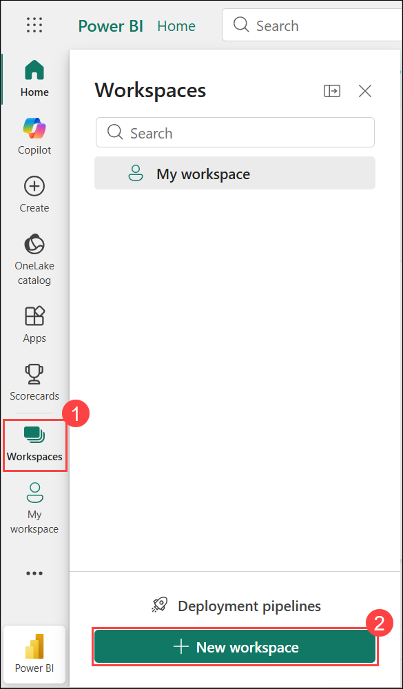

1. Create a new workspace with a name **Workspace-<inject key="DeploymentID" enableCopy="false"/> (1)**, and then click **Advanced**. Select a Fabric and Power BI workspaces types that includes **Fabric (2)**, then select **Capacity<inject key="DeploymentID" enableCopy="false"/> (3)** and click on **Apply (4)**.

   

   

   > **Note**: If you receive the **Introducing task flows (preview)** pop-up, click **Got it** to continue.

   

1. When your new workspace opens, it should be empty.

   

1. In the workspace, click the **Manage access** option from the upper-right corner to open the **Manage access** pane and click on **+ Add people or groups**.

   

1. In the **Add people** pane, enter **https://aec-svc/** **(1)**, ensure the permission is set to **Admin (2)** by using dropdown, and then click **Add (3)**.

   

> **Congratulations** on completing the task! Now, it's time to validate it. Here are the steps:
>
> - If you receive a success message, you can proceed to the next task.
> - If not, carefully read the error message and retry the step, following the instructions in the lab guide.
> - If you need any assistance, please contact us at cloudlabs-support@spektrasystems.com. We are available 24/7 to help you out.

<validation step="f77f6f86-fc3c-4fca-a8d2-234693b73ba8" />

## Task 2: Create a Lakehouse

Now that you have a workspace, it's time to switch to the Data engineering experience in the portal and create a data lakehouse for your data files.

1. Ensure the **Power BI** **(1)** icon is visible in the left pane. Click on **+ New item** **(2)** at the top of the workspace.

   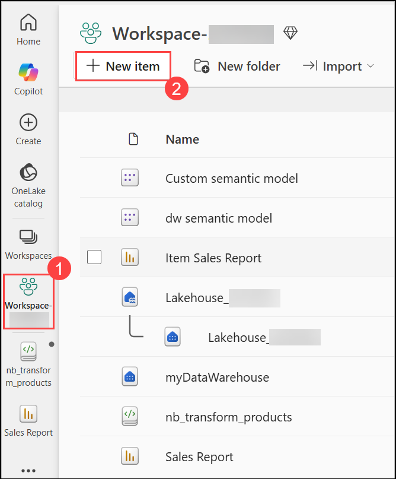

1. Search for **Lakehouse (1)** and select the option labeled **Lakehouse (2)** from the results.

   

1. On the **New lakehouse** pane, enter **Lakehouse_<inject key="DeploymentID" enableCopy="false"/> (1)** in the **Name** field, then click **Create** **(2)** to proceed.

      

1. View the new lakehouse, and note that the **Lakehouse explorer** pane on the left enables you to browse tables and files in the lakehouse:

   - The **Tables** folder contains tables that you can query using SQL semantics. Tables in a Microsoft Fabric lakehouse are based on the open source Delta Lake file format, commonly used in Apache Spark.
   - The **Files** folder contains data files in the OneLake storage for the lakehouse that aren't associated with managed delta tables. You can also create shortcuts in this folder to reference data that is
     stored externally.
   - Currently, there are no tables or files in the lakehouse.

     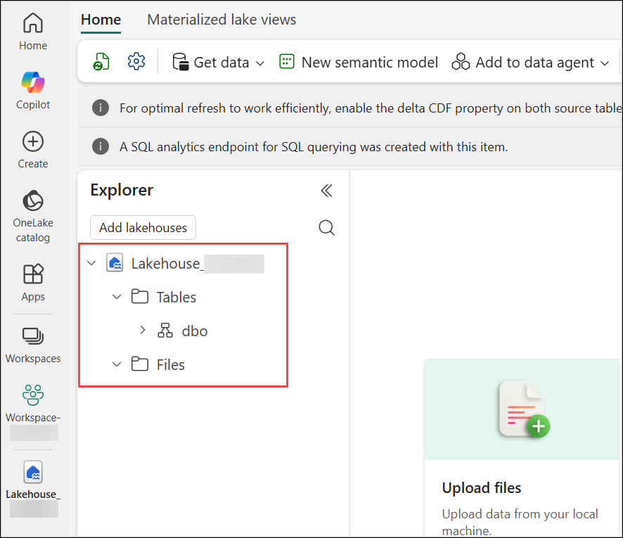

## Task 3: Upload a file

Fabric provides multiple ways to load data into the lakehouse, including built-in support for pipelines that copy data from external sources and data flows (Gen 2) that you can define using visual tools based on Power Query. However, one of the simplest ways to ingest small amounts of data is to upload files or folders from your lab VM.

1. On the **Lakehouse explorer** pane, click the ellipses **(1)** next to the **Files** folder, then select **New subfolder** **(2)**.

   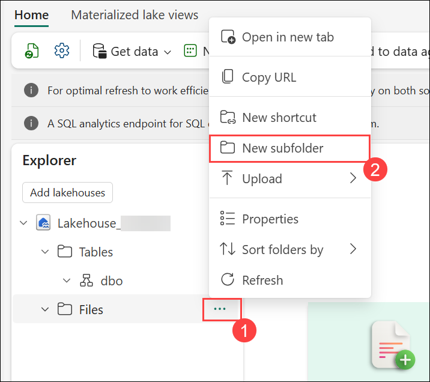

1. On the **New subfolder** pane, enter **data** **(1)** in the **Folder name** field, then click **Create** **(2)** to add the subfolder.

   

1. On the **Lakehouse explorer** pane, click the ellipses **(1)** next to the **data** folder, hover over **Upload** **(2)**, then select **Upload files** **(3)**.

   

1. On the **Upload files** dialog, click the folder icon on the right to browse, go to path **C:\LabFiles\dp-data-main** and select the **sales.csv** file from your lab machine.

   
   
   

1. On the **Upload files** dialog, after selecting the **sales.csv** file, click **Upload** **(1)** to upload the file into the **data** folder.

   

1. Once the upload is complete and the status shows **Completed**, click the **Close** icon at the top right to exit the **Upload files** dialog.

   

1. In the **Lakehouse explorer** pane, expand **Lakehouse_<inject key="DeploymentID" enableCopy="false"/>(1)**, then expand **Files** **(2)** and select the **data** **(3)** folder. Verify that the **sales.csv** **(4)** file has been uploaded successfully.

   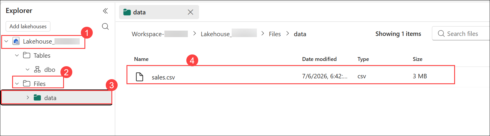

1. Select the **sales.csv** file to see a preview of its contents.

   

## Task 4: Explore shortcuts

In many scenarios, the data you need to work with in your lakehouse may be stored in some other location. While there are many ways to ingest data into the OneLake storage for your lakehouse, another option is to instead create a shortcut. Shortcuts enable you to include externally sourced data in your analytics solution without the overhead and risk of data inconsistency associated with copying it.

1. In the **ellipses (1)** menu for the **Files** folder, select **New shortcut (2)**.

   

1. View the available data source types for shortcuts. Then close the **New shortcut** dialog box without creating a shortcut.

   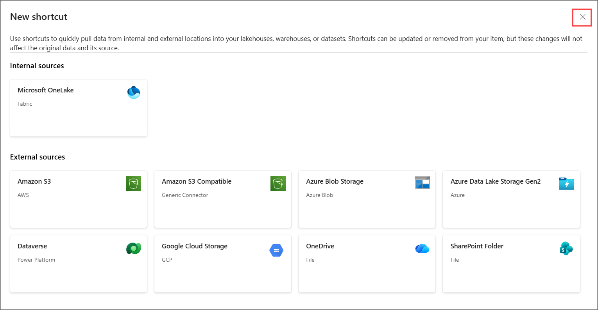

## Task 5: Load file data into a table

The sales data you uploaded is in a file that data analysts and engineers can work with directly by using Apache Spark code. However, in many scenarios, you may want to load the data from the file into a table so that you can query it using SQL.

1. In the **Lakehouse explorer** pane, expand **Lakehouse** **(1)**, then expand **Files** **(2)** and select the **data** folder **(3)**. Confirm that the **sales.csv** file appears in the folder **(4)**.

   

1. In the **data** folder, click the ellipses next to the **sales.csv** file to open the context menu.

   

1. In the context menu, hover over **Load to Tables** **(1)**, then select **New table** **(2)** to start creating a table from the CSV file.

   

1. In the **Load file to new table** dialog box, set the table name to **sales (1)** and confirm the load operation by selecting **Load (2)**. Then wait for the table to be created and loaded.

   > **Tip**: If the **sales** table does not automatically appear, in the **ellipses** menu for the **Tables** folder, select **Refresh**.

   

1. In the **Lakehouse explorer** pane, expand **Lakehouse** **(1)**, then expand **Tables** and select **sales** **(2)**. Confirm that the data from the **sales.csv** file is now loaded and displayed in table format **(3)**.

   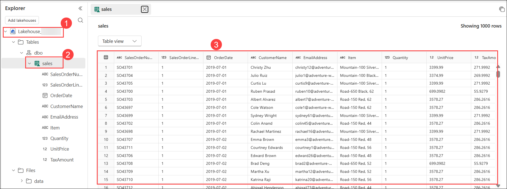

1. In the **ellipses (1)** menu for the **sales** table, select **View files (2)** to see the underlying files for this table.

   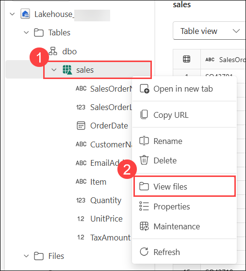

1. In the **File view** for the **sales** table, observe that it contains Delta Lake log files and Parquet data files. These represent the physical storage format of the table.

   

   > **Note:** Files for a delta table are stored in Parquet format, and include a subfolder named **\_delta_log** in which details of transactions applied to the table are logged.

## Task 6: Use SQL to query tables

When you create a lakehouse and define tables in it, a SQL endpoint is automatically created through which the tables can be queried using SQL `SELECT` statements.

1. At the top-right of the Lakehouse page, switch from **Analyze data with (1)** to **SQL analytics endpoint (2)**. Then wait a short time until the SQL query endpoint for your lakehouse opens in a visual interface from which you can query
   It's tables, as shown here:

   

1. On the **Home** tab, click the dropdown arrow next to **New SQL query** **(1)**, then select **New SQL query** **(2)** to open a new query editor.

   

1. In the new query editor, enter the following SQL query to calculate the total revenue by item:

   ```sql
   SELECT Item, SUM(Quantity * UnitPrice) AS Revenue
   FROM sales
   GROUP BY Item
   ORDER BY Revenue DESC;
   ```

1. Use the **&#9655; Run** button to run the query and view the results, which should show the total revenue for each product.

   

## Task 7: Create a visual query

While many data professionals are familiar with SQL, data analysts with Power BI experience can apply their Power Query skills to create visual queries.

1. On the **Home** tab, click the dropdown arrow next to **New SQL query** **(1)**, then select **New visual query** **(2)** to open the visual query editor.

   

1. Drag the **sales (1)** table to the new visual query editor pane that opens to create a **Power Query (2)** as shown here:

   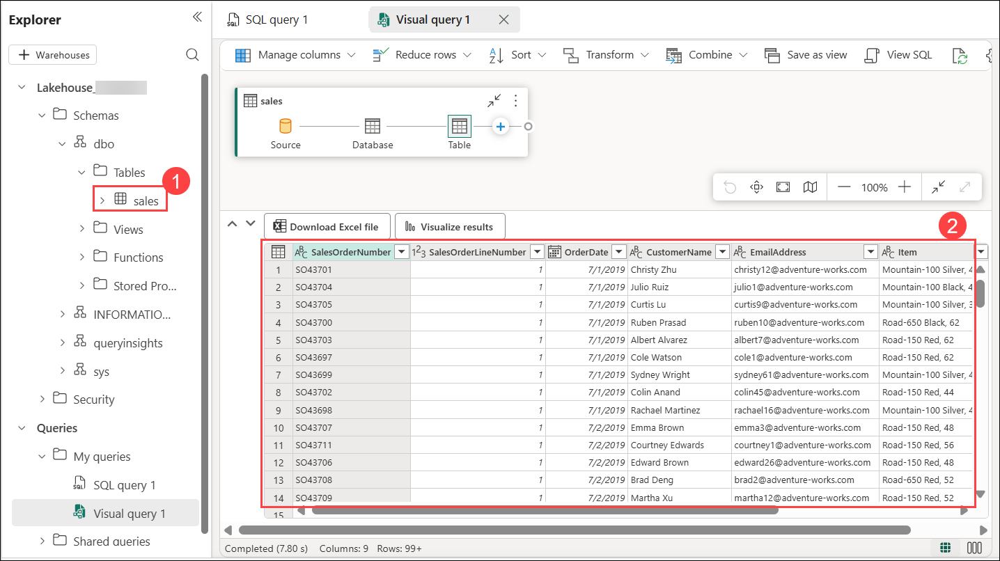

1. In the **Visual query 1** pane, click **Manage columns** **(1)** and select **Choose columns** **(2)**.

   

1. In the **Choose columns** dialog, select only **SalesOrderNumber** and **SalesOrderLineNumber** **(1)**, then click **OK** **(2)**.

   

1. On the **Visual query 1** tab, click **Transform** **(1)**, then select **Group by** **(2)** to start grouping the selected columns.

   

1. On the **Group by** dialog, configure the following **Basic** **(1)** settings:

   - **Group by**: SalesOrderNumber **(2)**
   - **New column name**: LineItems **(3)**
   - **Operation**: Count distinct values **(4)**
   - **Column**: SalesOrderLineNumber **(5)**
   - Click **OK** **(6)** to apply the grouping.

   - When you're done, the results pane under the visual query shows the number of line items for each sales order.

      

## Task 8: Create a Report

In this task, we will create a new semantic model and add a table to the dataset, which will define the data model to be used for reporting in Power BI.

1. Under the **Home** tab, click on **New semantic model** **(1)** to create the semantic model.

   

   > **Note**: In this exercise, the data model consists of a single table. In a real-world scenario, you would likely create multiple tables in your lakehouse, each of which would be included in the model. You could then define relationships between these tables in the model.

1. Enter **Custom semantic model** **(1)** in the name field and select the table **sales** **(2)**, than click on **Confirm** **(3)** to proceed.

   

1. In the hub menu bar on the left, click on your workspace **Workspace-<inject key="DeploymentID" enableCopy="false"/> (1)**.

   

1. Select the **Custom semantic model** and click on **Create report** option to begin creating a report using the semantic model.

   

1. In the **Data** pane, expand the **sales** table **(1)**, then:

   - Select **Item** **(2)** to use it as the category.
   - Select **Quantity** **(3)** to calculate the total quantity for each item.
   - A **Table Visualization** **(4)** is automatically added to the report canvas.

      

      > **Note**: This table report presents aggregated sales data for each item, allowing users to monitor product performance, identify high-demand products, and validate that the sales data has been loaded correctly into the semantic model.

1. In the **Visualizations** pane, follow these steps to convert the table into a clustered bar chart:

   - Click the **Build visual (1)** icon to ensure you're in visual editing mode.
   - Select the **Clustered bar chart (2)** visualization type.
   - The report canvas updates to display the item-wise total quantity in a bar chart **(3)**.

      

      > **Note:** This bar chart visualizes the total quantity sold for each item, making it easier to compare product sales performance and quickly identify the highest-selling products based on sales volume.

1. To save the report, click **File** **(1)** in the top menu, then select **Save** **(2)**.

   

1. On the **Save your report** screen, enter **Item Sales Report** **(1)** as the name, then click **Save** **(2)** to save it to the selected workspace.

   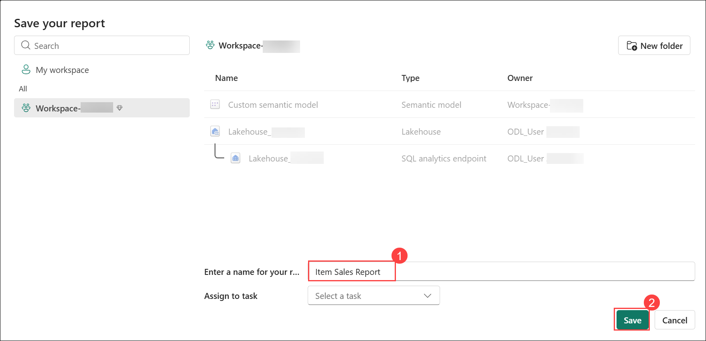

1. To share your report with your team or external users, click the Share button located in the top-right corner of the report. Enter the recipient's name or email address, configure the required access permissions, and then click Grant Access to share the report.

   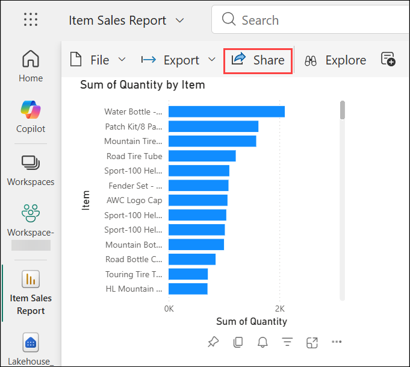

1. Then, in the hub menu bar on the left, select your **workspace (1)** to verify that it contains the following items:

   - Your lakehouse.
   - The SQL analytics endpoint for your lakehouse.
   - A default dataset for the tables in your lakehouse.
   - The **Item Sales Report** report. **(2)**

      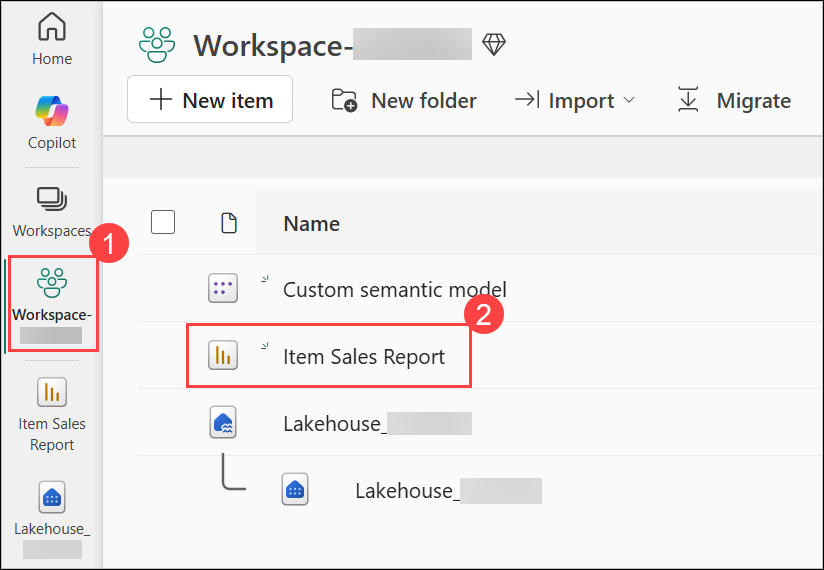

> **Congratulations** on completing the task! Now, it's time to validate it. Here are the steps:
>
> - If you receive a success message, you can proceed to the next task.
> - If not, carefully read the error message and retry the step, following the instructions in the lab guide.
> - If you need any assistance, please contact us at cloudlabs-support@spektrasystems.com. We are available 24/7 to help you out.

<validation step="8be3d605-b09f-4738-b1e5-c83a1e304b80" />

<validation step="d75ef970-6298-404c-aeeb-8dafe17b3ac2" />

## 📝 Summary

In this exercise, you have accomplished the following:

- Created a workspace to organize and manage your resources
- Built a Lakehouse for storing and processing data
- Uploaded a file into the Lakehouse environment
- Explored shortcuts to efficiently manage data access
- Loaded file data into a structured table
- Queried tables using SQL for data exploration
- Designed a visual query for easier insights
- Created a report to visualize and share your findings

### You have successfully completed the lab. Click on **Next >>**.


