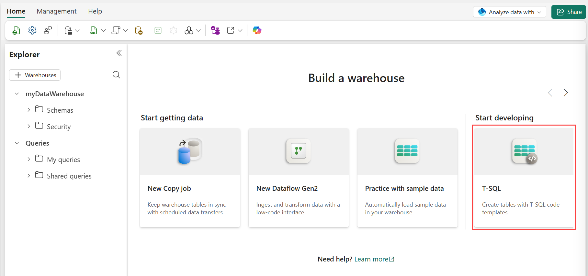
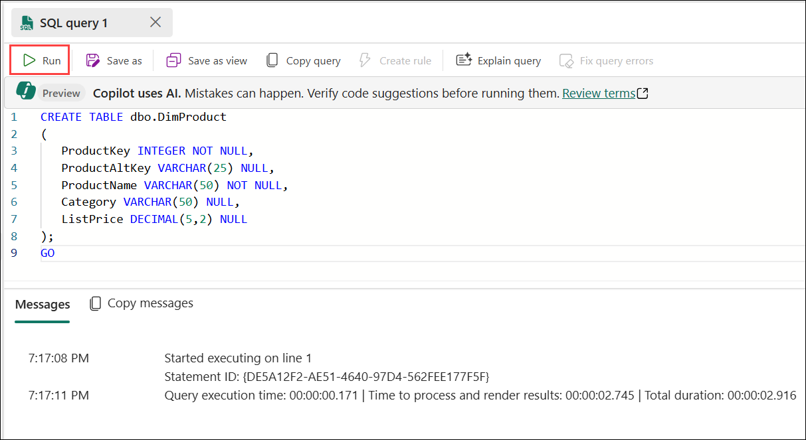
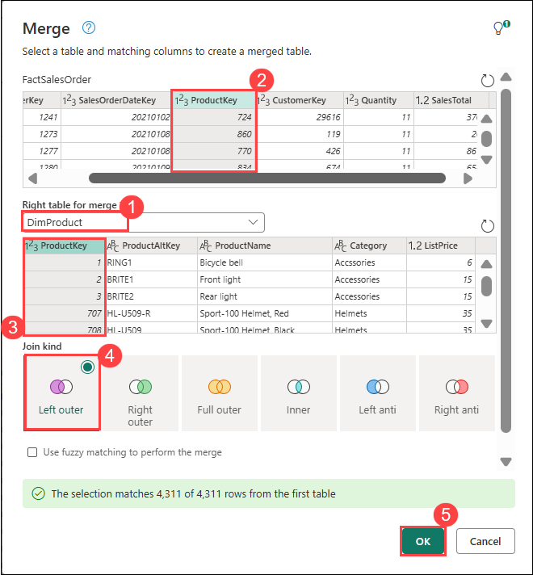
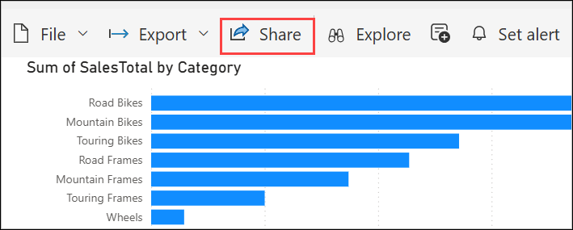

# Lab 02: Analyze data in a Data Warehouse

### Estimated Duration: 90 Minutes

## 📘 Scenario

Contoso Retail wants to improve its reporting and decision-making capabilities by centralizing business data in a modern analytics platform. The organization has chosen Microsoft Fabric Data Warehouse to store, organize, and analyze data from multiple sources in a structured and scalable way.

As a Data Analyst, you will create a Data Warehouse, load and manage data, build a data model, run SQL queries, create views, and develop Power BI reports to generate meaningful business insights.

## 📋 Overview

Fabric Data Warehouse is not a traditional enterprise data warehouse, it's a lake warehouse that supports two distinct warehousing items: the Fabric warehouse item and the SQL analytics endpoint item. Both are purpose-built to meet customers' business needs while providing best in class performance, minimizing costs, and reduced administrative overhead.

Here, you'll learn about data warehouses in Fabric, create a data warehouse, load, query, and visualize data, and describe datasets.

## 🏗️ Architecture Diagram


## 🎯 Objectives

In this lab, you will complete the following tasks:

- Task 1: Create a Data Warehouse
- Task 2: Create tables and insert data
- Task 3: Define a Data Model
- Task 4: Query data Warehouse tables
- Task 5: Create a View, Visual Query and Visualizing data

## Task 1: Create a Data Warehouse

In this task, you will provision a new data warehouse within Microsoft Fabric. A data warehouse in Fabric offers a fully managed relational database designed for large-scale analytics. Unlike the default read-only SQL endpoint provided for lakehouse tables, a data warehouse supports complete SQL capabilities, including inserting, updating, and deleting data. This enables you to design and manage structured schemas, load data efficiently, and prepare it for advanced querying and reporting.

1. In the Power BI portal, make sure you are in workspace **Workspace-<inject key="DeploymentID" enableCopy="false"/>**, then click **Power BI** **(1)** on the left navigation bar, and click **+ New item** **(2)** to create a new workspace item.

   

1. On the **New item** page, search for **Warehouse** in the search bar **(1)**, then select the **Warehouse** tile **(2)** to create a new warehouse.

   

1. On the **New warehouse** pane, enter **myDataWarehouse** **(1)** in the Name field, then click **Create** **(2)** to provision the warehouse.

   

   >**Note:** A Data Warehouse is used to store and organize business data in one place so that it can be easily analyzed and used for creating reports and dashboards.

## Task 2: Create tables and insert data

A warehouse is a relational database in which you can define tables and other objects.

1. In your new warehouse, select the **Create tables** with **T-SQL** tile, and replace the default SQL code with the following CREATE TABLE statement:

   

   ```sql
   CREATE TABLE dbo.DimProduct
   (
      ProductKey INTEGER NOT NULL,
      ProductAltKey VARCHAR(25) NULL,
      ProductName VARCHAR(50) NOT NULL,
      Category VARCHAR(50) NULL,
      ListPrice DECIMAL(5,2) NULL
   );
   GO
   ```

1. Use the **&#9655; Run** button to run the SQL script, which creates a new table named **DimProduct** in the **dbo** schema of the data warehouse.

   

1. To refresh the Explorer pane and view the latest changes, click the **Refresh** icon in the top left menu bar.

   

1. In the **Explorer** pane, expand **myDataWarehouse** **(1)**, then expand the **Schemas** section **(2)** to view the available schema objects, including `dbo`, `INFORMATION_SCHEMA`, `queryinsights`, and `sys`.

   

1. On the **Home** tab, click the dropdown next to **New SQL query** **(1)**, then select **New SQL query** **(2)** to open a new query editor.

   

   

1. After inserting the query, click **Run** to execute it. This query will insert three rows into the **DimProduct** table.

   ```sql
   INSERT INTO dbo.DimProduct
   VALUES
   (1, 'RING1', 'Bicycle bell', 'Accessories', 5.99),
   (2, 'BRITE1', 'Front light', 'Accessories', 15.49),
   (3, 'BRITE2', 'Rear light', 'Accessories', 15.49);
   GO
   ```

   

1. In the **Explorer** pane, expand **myDataWarehouse** **(1)**, then expand **Schemas** **(2)**, **dbo** **(3)**, and **Tables** **(4)**, then select the **DimProduct** table **(5)** and verify that the three inserted rows are displayed in the data preview.

   

1. Open each script link in a separate browser tab. Copy the complete Transact-SQL code from the **Dimensions Script**, **FactSalesOrder Script - Part 1**, and **FactSalesOrder Script - Part 2**. Paste all three scripts into the same SQL query editor in the exact order listed, then click Run to execute the complete script.

   - [Dimensions Script](https://raw.githubusercontent.com/CloudLabs-MOC/mslearn-fabric/refs/heads/main/Instructions/Labs/Dimensions.txt)
   - [FactSalesOrder Script - Part 1](https://raw.githubusercontent.com/CloudLabs-MOC/mslearn-fabric/refs/heads/main/Instructions/Labs/FactSalesOrder-1.txt)
   - [FactSalesOrder Script - Part 2](https://raw.githubusercontent.com/CloudLabs-MOC/mslearn-fabric/refs/heads/main/Instructions/Labs/FactSalesOrder-2.txt)

   > **For Windows users**: To copy the entire file content, press **Ctrl + A** to select all the text, and then press **Ctrl + C** to copy it and **Ctrl + V** to paste it.

   > **For Mac users:** To copy the entire file content, press **⌘ Command + A** to select all the text, and then press **⌘ Command + C** to copy it and **⌘ Command + V** to paste it.

   > **Note:** Ensure that the contents of all three files are pasted into the **same query editor** and in the **same order** before running the script.

   > **Note:** If running all three scripts together doesn't work, run each script separately in different queries and wait for it to complete before running the next. If a pop-up appears saying **Power BI page is unresponsive**, select **Wait** and continue waiting until the script executes successfully.

1. For copy-pasting inside the VM:

   - Set **Clipboard access** to **Allow**.

      

   - Then enable the VM native clipboard to copy and paste inside the virtual machine.

      

1. Run the query, which creates a simple data warehouse schema and loads some data. The script should take around 30 seconds to run.

   

1. Use the **Refresh (1)** button on the toolbar to refresh the view. Then, in the **Explorer** pane, verify that the **dbo** schema in the data warehouse now contains the following four **tables (2)**:

   - **DimCustomer**
   - **DimDate**
   - **DimProduct**
   - **FactSalesOrder**

   

   > **Tip:** If the schema takes a while to load, refresh the browser page.

## Task 3: Define a Data Model

A relational data warehouse typically consists of fact and dimension tables. The fact tables contain numeric measures you can aggregate to analyze business performance (for example, sales revenue), and the dimension tables contain attributes of the entities by which you can aggregate the data (for example, product, customer, or time). In a Microsoft Fabric data warehouse, you can use these keys to define a data model that encapsulates the relationships between the tables.

1. Under the **Home** tab, Click on  **New semantic model** to create the semantic model.

   

1. Enter **dw semantic model** **(1)** in the name field and select the tables **DimCustomer**,**DimDate**,**DimProduct**,**FactSalesOrder** **(2)**, than click on **Confirm** **(3)** to proceed.

   

1. In the hub menu bar on the left, Click on your workspace **Workspace-<inject key="DeploymentID" enableCopy="false"/> (1)**

   

1. Select the **dw semantic model** **(1)** and click on **Open semantic model** **(2)** option to edit the semantic model.

   

1. At the top right corner, Click on **Viewing (1)** to change it to **Editing** **2** permission settings. 

   

1. In the model pane, rearrange the tables in your data warehouse so that the **FactSalesOrder** table is in the middle, like this:

   

1. In the **Home** tab, click on **Manage relationships**.

   

1. In the Manage relationships window, select **+ New relationship**.

   

1. In the **New relationship** dialog, confirm the following:

   - **From table**: FactSalesOrder **(1)**
   - **Column**: ProductKey **(2)**
   - **To table**: DimProduct **(3)**
   - **Column**: ProductKey **(4)**
   - **Cardinality**: Many to one (*:1) **(5)**
   - **Cross-filter direction**: Single **(6)**
   - **Make this relationship active**: Checked **(7)**
   - Click **Save** **(8)** to create the relationship.

      

1. Repeat the process to create many-to-one relationships between the following tables:

   - **FactSalesOrder.CustomerKey** &#8594; **DimCustomer.CustomerKey**
   - **FactSalesOrder.SalesOrderDateKey** &#8594; **DimDate.DateKey**

      

      > **Note**: When all of the relationships have been defined, the model should look like this.

## Task 4: Query data Warehouse tables

Since the data warehouse is a relational database, you can use SQL to query its tables.

### Query fact and dimension tables

Most queries in a relational data warehouse involve aggregating and grouping data (using aggregate functions and GROUP BY clauses) across related tables (using JOIN clauses).

1. In the hub menu bar on the left, Click on your workspace **Workspace-<inject key="DeploymentID" enableCopy="false"/> (1)** and select the **myDataWarehouse** **(2)** warehouse.

   

1. On the **Home** tab, click the dropdown next to **New SQL query** **(1)**, then select **New SQL query** **(2)** to open a new query editor

   

1. Copy and paste the following code and click on **Run**: This query calculates **monthly sales revenue** by combining **sales and date data**, and displays the results in chronological order.

   ```sql
   SELECT  d.[Year] AS CalendarYear,
           d.[Month] AS MonthOfYear,
           d.MonthName AS MonthName,
          SUM(so.SalesTotal) AS SalesRevenue
   FROM FactSalesOrder AS so
   JOIN DimDate AS d ON so.SalesOrderDateKey = d.DateKey
   GROUP BY d.[Year], d.[Month], d.MonthName
   ORDER BY CalendarYear, MonthOfYear;
   ```

   

   > **Note:** The attributes in the time dimension enable you to aggregate the measures in the fact table at multiple hierarchical levels - in this case, year and month. This is a common pattern in data warehouses.

1. Modify the query as follows to add a second dimension to the aggregation.

   ```sql
   SELECT  d.[Year] AS CalendarYear,
          d.[Month] AS MonthOfYear,
          d.MonthName AS MonthName,
          c.CountryRegion AS SalesRegion,
         SUM(so.SalesTotal) AS SalesRevenue
   FROM FactSalesOrder AS so
   JOIN DimDate AS d ON so.SalesOrderDateKey = d.DateKey
   JOIN DimCustomer AS c ON so.CustomerKey = c.CustomerKey
   GROUP BY d.[Year], d.[Month], d.MonthName, c.CountryRegion
   ORDER BY CalendarYear, MonthOfYear, SalesRegion;
   ```

1. Run the modified query and review the results, which now include sales revenue aggregated by year, month, and sales region.

    This query calculates total sales revenue by month, year, and sales region, and displays the results in chronological order.

   

## Task 5: Create a View, Visual Query and Visualizing data

A data warehouse in Microsoft Fabric has many of the same capabilities you may be used to in relational databases. For example, you can create database objects like views and stored procedures to encapsulate SQL logic.

### Create a View

1. Modify the query you created previously as follows to create a view (note that you need to remove the ORDER BY clause to create a view) and **run** the query to create the view.

   ```sql
   CREATE VIEW vSalesByRegion
   AS
   SELECT  d.[Year] AS CalendarYear,
          d.[Month] AS MonthOfYear,
          d.MonthName AS MonthName,
          c.CountryRegion AS SalesRegion,
         SUM(so.SalesTotal) AS SalesRevenue
   FROM FactSalesOrder AS so
   JOIN DimDate AS d ON so.SalesOrderDateKey = d.DateKey
   JOIN DimCustomer AS c ON so.CustomerKey = c.CustomerKey
   GROUP BY d.[Year], d.[Month], d.MonthName, c.CountryRegion;
   ```
   

1. Then **refresh** the data warehouse schema and verify that the new view is listed in the **Explorer** pane.

   

1. Create a new SQL query and run the following SELECT statement. This query displays sales revenue by year, month, and sales region using the vSalesByRegion view, with results sorted chronologically.

   ```SQL
   SELECT CalendarYear, MonthName, SalesRegion, SalesRevenue
   FROM vSalesByRegion
   ORDER BY CalendarYear, MonthOfYear, SalesRegion;
   ```
   

   

### Create a visual query

Instead of writing SQL code, you can use the graphical query designer to query the tables in your data warehouse. This experience is similar to Power Query online, where you can create data transformation steps with no code. For more complex tasks, you can use Power Query's M (Mashup) language.

1. On the **Home** tab, click the dropdown arrow next to **New SQL query** **(1)**, then select **New visual query** **(2)** to open the visual query editor.

   

1. Drag **FactSalesOrder** onto the **canvas**. Notice that a preview of the table is displayed in the **Preview** pane below.

1. Drag **DimProduct** onto the **canvas**. We now have two tables in our query.

1. Use the **(+)** button on the **FactSalesOrder** table on the canvas to **Merge queries**.

   

1. In the **Merge queries** window, select **DimProduct** **(1)** as the right table for merge, then select the **ProductKey** **(2)** column in both the source table and the right table **(3)**, keep the join kind as **Left outer** **(4)**, and click **OK** **(5)** to proceed.

   

1. In the **Preview**, note that the new **DimProduct (1)** column has been added to the FactSalesOrder table. Expand the column by clicking the arrow to the right of the column name. Select **ProductName (2)** and click **OK (3)**.

   

1. If you're interested in looking at data for a single product, per a manager's request, you can now use the **ProductName** column to filter the data in the query. Filter the **ProductName** column to look at **Cable Lock** data only.

1. From here, you can analyze the results of this single query by selecting **Visualize results** or **Open in Excel**. You can now see exactly what the manager was asking for, so we don't need to analyze the results further.

### Visualize your data

You can easily visualize the data in either a single query or in your data warehouse. Before you visualize, hide columns and/or tables that aren't friendly to report designers.

1. In the hub menu bar on the left, click on your workspace **Workspace-<inject key="DeploymentID" enableCopy="false"/>**.

   

1. Select the **dw semantic model** **(1)** and click on **Open semantic model** **(2)** option to edit the semantic model.

   

1. At the top right corner, Click on **Viewing** **1** to change it to **Editing** **2** permission settings. 

   

1. Hide the following columns in your Fact and Dimension tables that are not necessary to create a report. Note that this does not remove the columns from the model; it simply hides them from view on the report canvas.

   1. FactSalesOrder
      - **SalesOrderDateKey**
      - **CustomerKey**
      - **ProductKey**
   1. DimCustomer
      - **CustomerKey**
      - **CustomerAltKey**
   1. DimDate
      - **DateKey**
      - **DateAltKey**
   1. DimProduct
      - **ProductKey**
      - **ProductAltKey**

      

1. Now you're ready to build a report and make this dataset available to others.

1. On the **File** tab **(1)**, click on **Create new report** **(2)** to begin creating a new Power BI report.

   

1. In the report canvas, expand the **DimProduct (1)** and **FactSalesOrder (2)** tables from the **Data** pane, then select the **Clustered bar chart** visual **(3)**. Add **Category** to the Y-axis and **SalesTotal** to the X-axis to create a bar chart visual **(4)**.

   

   > The visualization displays total sales revenue by product category, allowing you to compare sales performance across different product categories.

1. To save the report, click **File** **(1)** in the top menu, then select **Save** **(2)**.

   

1. In the **Save report** dialog box, enter the name **Sales Report (1)** in the text field (1), then click **Save** **(2)** to store the report.

   

1. To share your report with your team or external users, click the **Share** button located in the top-right corner of the report. Enter the recipient's name or email address, configure the required access permissions, and then click Grant Access to share the report.
 
   

1. In the menu hub on the left, navigate back to the workspace. Notice that you now have three items saved in your workspace: your data warehouse, its default dataset, and the report you created.

    
    
## 📝 Summary

In this exercise, you have accomplished the following:

- Created a Data Warehouse.
- Created tables and inserted sample data.
- Defined a Data Model to support reporting.
- Queried data from the Data Warehouse tables.
- Created a View, performed Visual Queries, and visualized the data.

### You have successfully completed the lab. Click on **Next >>**.


