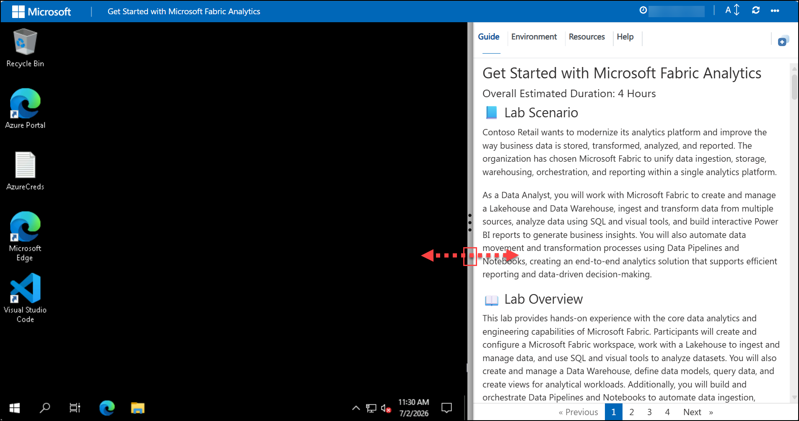

# Get Started with Microsoft Fabric Analytics

### Overall Estimated Duration: 4 Hours

## 📘 Lab Scenario

Contoso Retail wants to modernize its analytics platform and improve the way business data is stored, transformed, analyzed, and reported. The organization has chosen Microsoft Fabric to unify data ingestion, storage, warehousing, orchestration, and reporting within a single analytics platform.

As a Data Analyst, you will work with Microsoft Fabric to create and manage a Lakehouse and Data Warehouse, ingest and transform data from multiple sources, analyze data using SQL and visual tools, and build interactive Power BI reports to generate business insights. You will also automate data movement and transformation processes using Data Pipelines and Notebooks, creating an end-to-end analytics solution that supports efficient reporting and data-driven decision-making.

## 📖 Lab Overview

This lab provides hands-on experience with the core data analytics and engineering capabilities of Microsoft Fabric. Participants will create and configure a Microsoft Fabric workspace, work with a Lakehouse to ingest and manage data, and use SQL and visual tools to analyze datasets. You will also create and manage a Data Warehouse, define data models, query data, and create views for analytical workloads. Additionally, you will build and orchestrate Data Pipelines and Notebooks to automate data ingestion, transformation, and loading processes. Throughout the lab, you will create reports and visualizations using Power BI, gaining practical experience in building end-to-end analytics solutions within Microsoft Fabric.

## 🎯 Lab Objectives

By the end of this lab, you will learn:

- **Creating and Ingesting Data with a Microsoft Fabric Lakehouse:** This hands-on exercise guides you through setting up a Microsoft Fabric workspace and configuring a Lakehouse for scalable storage. You will ingest data from various sources, convert files into structured tables, perform data analysis using SQL and visual query tools, and create reports to visualize business insights.

- **Analyzing Data in a Data Warehouse:** This hands-on exercise involves creating and configuring a Data Warehouse, creating tables and data models, querying data using SQL, and creating views to support reporting and analytical workloads. You will gain experience in managing and analyzing structured data within Microsoft Fabric.

- **Automating Data Integration with Data Pipelines:** This hands-on exercise introduces Microsoft Fabric Data Pipelines and Notebooks for automating data movement and transformation. You will ingest data into a Lakehouse, transform raw data into curated Delta tables, load data into a Data Warehouse using cross-database queries, and orchestrate an end-to-end ETL workflow through a single pipeline.

## ⚙️ Prerequisites 

Participants should have:

- **Basic Understanding of Data Warehousing and Data Lakes:** Familiarity with the concepts of structured and unstructured data storage.

- **SQL Knowledge:** Ability to write and understand basic SQL queries.
- **Data Analysis:** Basic experience with data analysis and reporting.
- **Microsoft Fabric Fundamentals:** Familiarity with Microsoft Fabric workspaces, navigation, and core analytics concepts.
- **Basic ETL Concepts:** Understanding of data ingestion, transformation, and loading processes.
- **Notebook and Data Pipeline Awareness:** Basic knowledge of notebooks and workflow orchestration concepts is beneficial but not required.
- **Power BI Fundamentals:** Familiarity with creating reports and visualizations using Power BI.

## 🏗️ Architecture

This lab introduces the Microsoft Fabric Lakehouse, a unified data platform that combines the flexibility and scalability of a data lake with the structured querying capabilities of a data warehouse. Key components include OneLake, a scalable storage layer built on Azure Data Lake Store Gen2, and Apache Spark, which provides high-performance in-memory computation for big data processing. SQL compute engines enable complex queries on large datasets, while Delta Lake ensures ACID transactions and efficient metadata handling. Additionally, Power BI and Power Query are integrated for advanced data visualization, reporting, and manipulation.

## 🖼️ Architecture diagram

## 🔍 Explanation of Components

- **Microsoft Fabric Workspace:** A centralized environment within Microsoft Fabric where users can manage their data projects. This workspace provides access to various tools and services needed to create and analyze data in a unified platform.

- **Lakehouse:** A scalable and flexible data store within Microsoft Fabric that combines the features of a data lake and a data warehouse. It allows for the storage and querying of both structured and unstructured data using SQL and Apache Spark compute engines.

- **OneLake Storage Layer:** The underlying scalable storage layer used by the Lakehouse, built on Azure Data Lake Store Gen2. It provides robust, scalable storage for large volumes of data in various formats.

- **Data Files and Tables:** Ingested data files that are uploaded into the Lakehouse. These files can be transformed into structured tables that allow for efficient querying and analysis. Tables in Microsoft Fabric Lakehouse are based on the open-source Delta Lake file format.

- **SQL Endpoint:** A feature within Microsoft Fabric that enables users to perform SQL queries on the Lakehouse tables. It provides a familiar SQL interface for data analysts and engineers to query and analyze data efficiently.

- **Power Query:** A data connection technology that enables users to discover, connect, combine, and refine data across a wide variety of sources. In the context of Microsoft Fabric, Power Query allows for visual query creation and data transformation.

- **Power BI:** A suite of business analytics tools within Microsoft Fabric that enables users to create interactive reports and dashboards. Power BI is integrated with the Lakehouse to provide a seamless reporting and visualization experience based on the ingested data.

- **Data Transformation:** The process of converting raw data into a structured format that can be used for analysis. This includes operations such as grouping, filtering, and summarizing data to prepare it for querying and reporting.

- **Report Building:** The creation of interactive reports using Power BI, based on the data stored in the Lakehouse. This involves designing report layouts, selecting visualizations, and configuring report elements to effectively display data insights.

- **Microsoft Fabric Data Pipeline:** A visual orchestration service within Microsoft Fabric that enables users to automate data movement and processing workflows. Data Pipelines allow multiple activities to be connected and executed in a defined sequence, simplifying end-to-end data integration and ETL processes.

- **Notebook Activity:** A pipeline activity that executes a Microsoft Fabric Notebook. It is commonly used to perform data transformations, cleansing, and enrichment operations using Apache Spark before loading data into downstream analytical systems.

- **Copy Activity:** A pipeline activity used to move data between different sources and destinations. In this lab, the Copy Activity ingests external data files into the Lakehouse, ensuring that data is available for further processing and analysis.

- **Delta Tables:** Structured tables stored in the Delta Lake format within the Lakehouse. Delta tables provide reliable and efficient storage with support for ACID transactions, schema enforcement, and optimized query performance.

- **Cross-Database Queries:** A feature in Microsoft Fabric that enables users to query data across different Fabric items. In this lab, cross-database queries are used to access Lakehouse Delta tables through the Warehouse SQL endpoint, allowing data to be loaded into the Data Warehouse without creating redundant copies.

- **Data Warehouse:** A relational analytics store within Microsoft Fabric designed for structured data analysis and reporting. The Data Warehouse provides full SQL capabilities and serves as the destination for curated data prepared through the pipeline workflow.

- **Pipeline Orchestration:** The process of coordinating multiple activities within a Data Pipeline to ensure that data ingestion, transformation, and loading operations execute in the correct order. This enables automated and repeatable end-to-end data workflows.

- **Pipeline Monitoring:** A feature that allows users to track pipeline execution, review activity status, troubleshoot failures, and validate successful completion of data integration processes.

# 🚀 Getting Started with the lab

Welcome to your **Get Started with Microsoft Fabric Analytics** workshop! We've prepared a seamless environment for you to explore Microsoft Fabric's end-to-end analytics capabilities. Throughout this workshop, you'll work with Lakehouses and Data Warehouses, automate data workflows using Pipelines and Notebooks, analyze data with SQL, and create insightful Power BI reports. Let's get started!

## Accessing Your Lab Environment

Once you're ready to dive in, your virtual machine and **Guide** will be right at your fingertips within your web browser.
 

## Virtual Machine & Lab Guide
 
Your virtual machine is your workhorse throughout the workshop. The lab guide is your roadmap to success.
 
## Exploring Your Lab Resources
 
To get a better understanding of your lab resources and credentials, navigate to the **Environment** details tab.
 

 
## Utilizing the Split Window Feature
 
For convenience, you can open the lab guide in a separate window by selecting the **Split Window** button from the top right corner.
 

 
## Managing Your Virtual Machine
 
Feel free to **start, stop, or restart (2)** your virtual machine as needed from the **Resources (1)** tab. Your experience is in your hands!
 

## Lab Guide Zoom In/Zoom Out

To adjust the zoom level for the environment page, click the **A↕** icon located next to the timer in the lab environment.

## Resize the Virtual Machine View

Use the **slider (three vertical dots)** located between the **Virtual Machine** and the **Lab Guide** panes to adjust the display size, allowing you to customize the layout based on your preference.

## Copy Paste Functionality

To copy the SQL script or any code snippet, click the **Copy button (1)** located at the top-right corner of the code block (as highlighted in the image). The copied content can then be pasted directly into your SQL editor or workspace.

Now you're all set to explore the powerful world of technology. Feel free to reach out if you have any questions along the way. 

## 📞 Support Contact

The CloudLabs support team is available 24/7, 365 days a year, via email and live chat to ensure seamless assistance at any time. We offer dedicated support channels tailored specifically for both learners and instructors, ensuring that all your needs are promptly and efficiently addressed.

Learner Support Contacts:
- Email Support: cloudlabs-support@spektrasystems.com
- Live Chat Support: https://cloudlabs.ai/labs-support

Now, click on Next from the lower right corner to move on to the next page.

### Happy Learning!!
